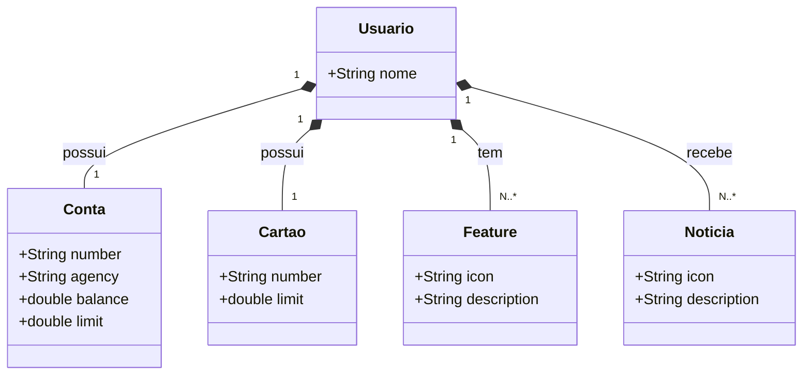

# Santander Dev Week 2025
Java RESTful API 
## Diagrama de Classes

```mermaid
classDiagram
    class Usuario {
        +String nome
    }

    class Conta {
        +String number
        +String agency
        +double balance
        +double limit
    }

    class Cartao {
        +String number
        +double limit
    }

    class Feature {
        +String icon
        +String description
    }

    class Noticia {
        +String icon
        +String description
    }

    Usuario "1" *-- "1" Conta : possui
    Usuario "1" *-- "1" Cartao : possui
    Usuario "1" *-- "N..*" Feature : tem
    Usuario "1" *-- "N..*" Noticia : recebe
```
